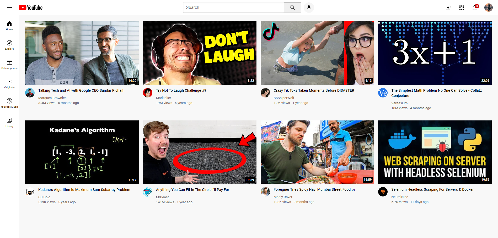

# YouTube Web Application .
  - CSS Grid & Flexbox -> Layout systems for arranging elements on a web page.
  - Position Property -> Controls the positioning of elements relative to their normal position in the document flow.
  - Nested Layout Techniques -> Combining different layout methods to achieve complex layouts.
  - div element -> A generic HTML element used to represent a division or section of content.
  - CSS Specificity -> Rules for determining which CSS style applies to an element when multiple styles are defined.
  - Semantic HTML Elements -> Using HTML elements that describe their meaning (e.g., heading (h1), paragraph (p)).

### Steps to Use:
---

1. **Download or clone the repository**
   ```shell
   git clone https://github.com/Thadkapally-Saikiran/YouTube-Web-Application.git
   
  - Go to the directory
  - Run the index.html file
  - Start Exploring!!

### ScreenShots



### Project Structure:
 - Channel-pictures: Folder containing channel pictures
 - icons: Folder containing icons.
 - thumbnails: Folder containing thumbnails.
 - icons: Folder containing icons.
 - intro-to-html: Folder containing HTML introduction files.
 - flexbox.html: HTML file for Flexbox demonstration.
 - grid.html: HTML file for Grid demonstration.
 - position.html: HTML file for CSS positioning demonstration.
 - index.html: Main HTML File to execute
